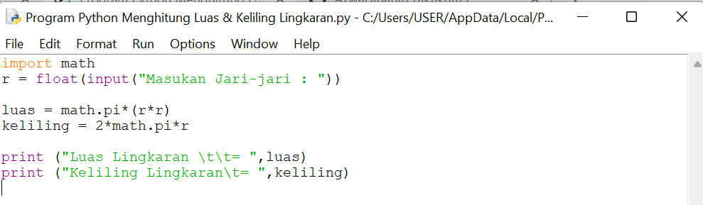
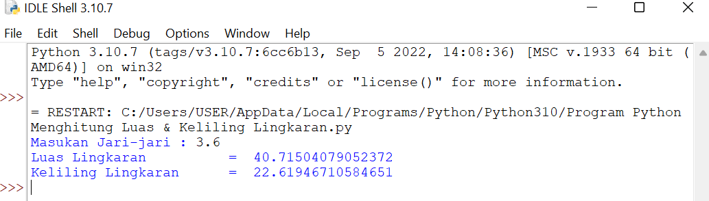

# Praktikum3
## program untuk menghitung luas dan keliling lingkaran menggunakan Python

### Rumus Luas & Keliling Lingkaran
Luas     = π × r²

Keliling = 2 x π × r

''Nilai Phi yang akan kita gunakan adalah 3.14

''r merupakan jari-jari lingkaran

Phi merupakan nilai konstanta di matematika sementara jari-jari merupakan jarak antara titik pusat dengan tepi lingkaran. Sebetulnya ada rumus lain untuk menghitung keliling lingkaran yaitu dengan menggunakan diameter, tapi pada kasus ini kita cukup menggunakan jari jari lingkaran saja.

#### Flowchart Menghitung Luas & Keliling Lingkaran

##### Program Python Menghitung Luas & Keliling Lingkaran

###### Output:
